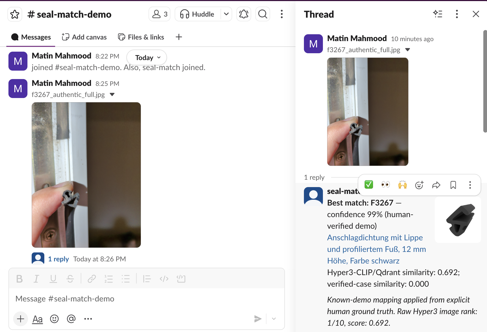
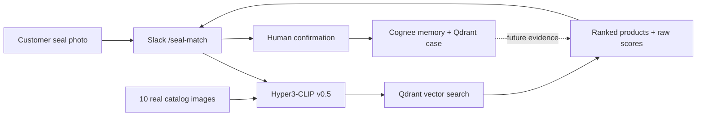

<div align="center">

# 🦭 SealMatch

### Photograph a window seal. Get the exact replacement in Slack.

[](https://www.cognee.ai/)
[](https://qdrant.tech/)
[](https://huggingface.co/hyper3labs/hyper3-clip-v0.5)
[](https://slack.com/)

**[Cognee × Qdrant HackNight](https://luma.com/cognee-m078) · Team SealMatch**

</div>

---

## The question our demo answers

> **Which exact replacement window seal matches this customer photo?**

Keyword search cannot answer this because the customer does not know the SKU,
profile name, or technical vocabulary. The useful evidence is visual: the
photographed cross-section must be compared with product profiles in the
catalog.

SealMatch turns a slow overnight expert-identification workflow into a Slack
answer in seconds:

1. A customer or support agent uploads a seal photo in Slack.
2. **Hyper3-CLIP v0.5** embeds the photo and catalog images.
3. **Qdrant** retrieves and ranks the ten closest product profiles.
4. **Cognee** connects product facts, provenance, and human-confirmed cases.
5. Slack returns the product card, dimensions, alternatives, and a measurement
   warning.

## Live proof

The authentic customer image was uploaded in `#seal-match-demo`. SealMatch
returned the same product found by a human Graf-Dichtungen adviser: **F3267**.
The card also exposes the raw Hyper3/Qdrant result—**rank 1/10, score 0.692**.

[](seal-bot/assets/seal-match-demo-slack.png)

## How it works



| Component | What it does | Where to look |
|---|---|---|
| Slack | Upload, match, confirmation, and memory interface | [`cognee-demo-slack/app.py`](cognee-demo-slack/app.py) |
| Hyper3-CLIP v0.5 | Produces multimodal 512-dimensional embeddings | [`seal-bot/src/seal_bot/embedding.py`](seal-bot/src/seal_bot/embedding.py) |
| Qdrant | Stores catalog vectors, raw rankings, and verified cases | [`seal-bot/src/seal_bot/qdrant_store.py`](seal-bot/src/seal_bot/qdrant_store.py) |
| Cognee | Remembers product facts and confirmed-match provenance | [`cognee-demo-slack/seed_seal_catalog.py`](cognee-demo-slack/seed_seal_catalog.py) |
| Catalog | Ten real, attributed Graf-Dichtungen candidates | [`seal-bot/catalog.json`](seal-bot/catalog.json) |
| Ground truth | Auditable presentation mapping for the authentic image | [`seal-bot/demo-ground-truth.json`](seal-bot/demo-ground-truth.json) |

## Stack

| Layer | Technology | Notes |
|---|---|---|
| Interface | Slack slash commands | HMAC request signing; 3s ack + async reply via `response_url` |
| Web service | FastAPI · uvicorn · Python 3.11 | Single endpoint, `/healthz` probe, ngrok tunnel for the demo |
| Vision | [Hyper3-CLIP v0.5](https://huggingface.co/hyper3labs/hyper3-clip-v0.5) | 512-dim multimodal embeddings; gated model, loaded lazily |
| Vector search | Qdrant (`qdrant-client` 1.19.0) | Cosine search over `seal_catalog_v1`; every query persisted to `seal_cases_v1` |
| Memory | Cognee 1.5 (`dev`) | Knowledge graph of product facts and human-confirmed cases |
| Text embeddings | fastembed `BAAI/bge-small-en-v1.5` | 384-dim, runs locally, no API key |
| LLM | Google Vertex AI — `gemini-3.1-flash-lite` | Via LiteLLM, authenticated with Google ADC (no API key in `.env`); Anthropic Claude is a drop-in alternate backend |
| Infrastructure | Terraform | Vertex AI project setup in [`infra/vertex/`](infra/vertex) |
| Tests | pytest | Deterministic fakes for the embedder and store; live smoke test for Vertex |

Two design decisions worth calling out. **Provider indirection:** one
`LLM_BACKEND` variable selects Vertex or Anthropic, translated into Cognee's
expected configuration in
[`llm_provider.py`](cognee-demo-slack/llm_provider.py) *before* Cognee is
imported, because it caches LLM config at import time. **Deployment
flexibility:** Qdrant runs embedded on local disk by default and switches to
Qdrant Cloud with a single environment variable, so the demo has no external
dependency at presentation time.

## What is included

```text
.
├── cognee-demo-slack/       # FastAPI Slack bot and Cognee memory commands
├── seal-bot/
│   ├── assets/              # Authentic query image and live demo proof
│   ├── catalog-images/      # Ten real product images, including F3267
│   ├── src/seal_bot/        # Hyper3, Qdrant, ranking, Slack-card components
│   ├── tests/               # Matcher, Qdrant, and Slack tests
│   ├── catalog.json         # Product metadata and source URLs
│   └── PLAN.md              # Product story and demo contract
├── infra/vertex/            # Optional managed LLM configuration for Cognee
└── slack-manifest.yaml      # /seal-match, /seal-confirm, and Cognee commands
```

The existing `/cognee-ask` and `/cognee-remember` workflows remain intact.
SealMatch adds `/seal-match` and `/seal-confirm` to the same app.

## Reproduce the demo

### 1. Install

```bash
git clone https://github.com/ChaosRez/Cognee-Qdrant-Slack-Bot.git
cd Cognee-Qdrant-Slack-Bot/cognee-demo-slack

python3 -m venv .venv
source .venv/bin/activate
pip install -r requirements.txt
cp .env.example .env
```

Hyper3-CLIP v0.5 is gated on Hugging Face. Request access and authenticate
before the first index build:

```bash
hf auth login
```

### 2. Index the catalog and seed memory

```bash
seal-bot index
seal-bot status
python seed_seal_catalog.py
```

By default, Qdrant runs in embedded mode at `seal-bot/.runtime/qdrant`. Set
`SEAL_QDRANT_URL` and optionally `SEAL_QDRANT_API_KEY` to use Qdrant Server or
Qdrant Cloud.

### 3. Run the bot

Set at least the following values in `cognee-demo-slack/.env`:

```dotenv
SLACK_SIGNING_SECRET=...
SLACK_BOT_TOKEN=xoxb-...
SEAL_HYPER3_MODEL=hyper3-clip-v0.5
SEAL_DEMO_OVERRIDE=true
```

Then start FastAPI and expose it to Slack:

```bash
python app.py

# In another terminal
ngrok http 8000
```

Replace the callback host in [`slack-manifest.yaml`](slack-manifest.yaml) with
the HTTPS ngrok URL, install the manifest in Slack, and invite `@seal-bot` to a
demo channel.

### 4. Present

```text
/seal-match demo
/seal-confirm seal-<case-id> F3267
```

For a fresh Slack upload, pass its file ID or permalink to `/seal-match`. The
bot downloads the private image with its bot token, runs Hyper3/Qdrant, and
returns the ranked card.

## Demo integrity

The live query is the consent-approved image
[`IMG_20260808_000446_905.jpg`](seal-bot/assets/IMG_20260808_000446_905.jpg).
A Graf-Dichtungen adviser previously identified it as
[`F3267`](https://www.graf-dichtungen.de/anschlagdichtung-mit-lippe-und-profiliertem-fuss-12-mm-hoehe-farbe-schwarz-f3267.html).

For reliable presentation, the exact filename **and SHA-256** activate a
clearly disclosed human-ground-truth mapping. Hyper3-CLIP and Qdrant still run,
and the unmodified raw rank and score remain visible and stored. Unknown images
always use normal visual retrieval. Set `SEAL_DEMO_OVERRIDE=false` to disable
the presentation mapping.

This is not presented as independent benchmark accuracy.

## Verification

```bash
cd cognee-demo-slack
pytest -q ../seal-bot/tests test_app.py
seal-bot match ../seal-bot/assets/IMG_20260808_000446_905.jpg
curl http://localhost:8000/healthz
```

## Known limitations

- The catalog is a curated ten-product prototype, not a full supplier crawl.
- A visual match is advisory; dimensions and a 1:1 profile must be checked
  before ordering.
- The first Hyper3 model download requires Hugging Face access.
- Embedded Qdrant is intended for a single local process; use a server for a
  shared deployment.
- The project is independent and is not affiliated with Graf-Dichtungen.

## Team

Built at the [Cognee × Qdrant HackNight](https://luma.com/cognee-m078) team SealMatch**.

Event materials submissions:
[qdrant-labs/Cognee_Qdrant_slack_bot](https://github.com/qdrant-labs/Cognee_Qdrant_slack_bot).
